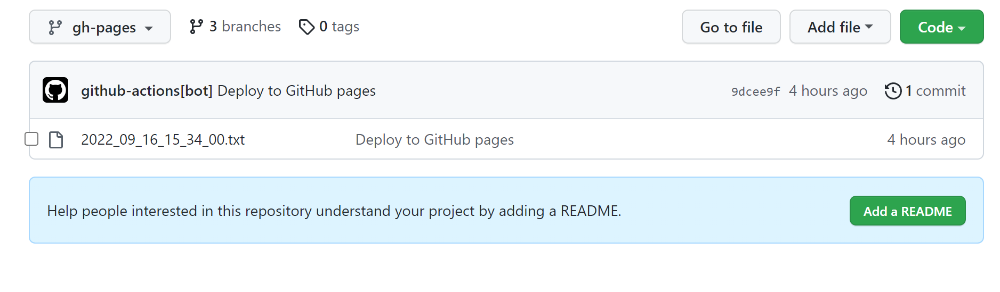
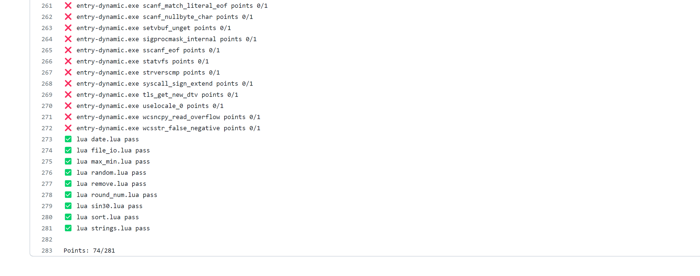
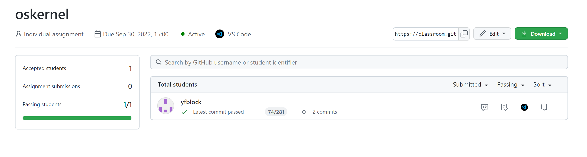
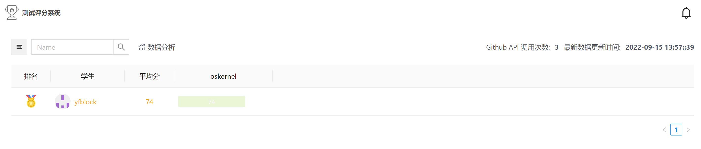
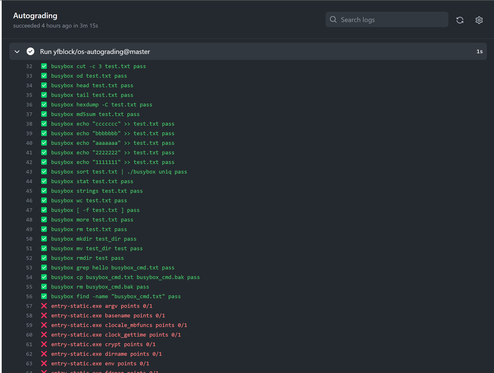

# 新的评测系统搭建方案
新的评测系统分为以下几个仓库
1. 源仓库（即需要评测的仓库）
2. 评测程序所在的仓库
3. 评测脚本所在的仓库
4. 排行榜仓库（可选）

> 这样在老师需要添加题目或者更新题目时，不再需要学生去同步仓库，评测更灵活

## 评测流程
1. 源仓库提交后执行GitHub Actions.
2. Github Actions准备评测环境
3. Github Actions执行`make`进行内核编译(与比赛相同，要求能生成kernel-qemu文件和sbi-qemu文件)
4. Github Actions从目标仓库下载需要评测时所需要的镜像
5. Github Actions利用`qemu`执行内核 并利用 `tee`指令记录输出到指定的输出文件
6. 利用`os-autograding`进行评分

## 仓库设置
1. [源仓库设置](源仓库设置.md)
2. [评测脚本仓库设置](评测脚本仓库设置.md)
3. [评测程序仓库设置](评测程序仓库设置.md)

添加了简单的日志系统，在源仓库每一次提交后会在`gh-pages`分支中生成一个log文件，文件名为日期和时间，文件内容为测例通过详情和总得分，方便同学们查看提交记录和信息。

目前已经测试过兼容Github Classroom,但是对于排行榜系统兼容性略差，目前做了一定修改，后面会尝试维护或重构。

eg: 排行榜系统在原有的基础上进行了魔改。设置步骤相同，但是源代码略有改动，如需部署请拉取 [https://github.com/os-autograding/classroom-grading-template](https://github.com/os-autograding/classroom-grading-template)

具体通过情况可以在`Github Actions`里的`yfblock/os-autograding`查看，后面会尝试添加到各个用户的`gh-pages`中。
